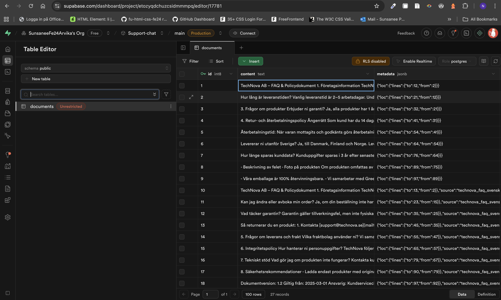

# Individuell examination - Kundtjänstbot TechNova AB

## Instruktioner

Du ska utveckla en AI-baserad kundsupportassistent för ett fiktivt företag som säljer teknikprodukter online.
Assistenten ska kunna svara på kundfrågor om produkter, leveranser och garantier genom att hämta information från företagets FAQ- och policydokument. Se bifogad textfil på Azomo för företagets FAQ-och policydokument.

## Kravspecifikation

* Det ska finnas ett gränssnitt för skriva till kundtjänstboten och ställa frågor.
* Kundtjänstboten ska komma ihåg vad som skrivits i tidigare meddelanden (dock inget krav på att komma ihåg tidigare sessioner etc).
* Kundtjänstboten ska kunna svara på frågor kring företagets FAQ-och policydokument.
* Kundtjänstboten ska ifall den använder information från företagets FAQ- och policydokument för att svara på kundens fråga visa i sitt svar vilka delar från företagets FAQ- och policydokument som ligger till grund för detta svar.
* Kundtjänstboten ska enbart kunna svara på frågor om TechNova AB, produkter, leveranser, garantier samt info från företagets FAQ-och policydokument. Det ska alltså inte kunna gå och fråga "Vad är Javascript?", då ska ett vänligt svar ges att jag kan inte svara på en sådan fråga.

## Extra funktioner
*Embedding model med Nomic
  - Jag valde att använda "nomic-embed-text:" istället för "llama3.1:8b" eftersom den visade sig vara mer effektiv och stabil för att omvandla text till vektorer.

*Language-validator
  - Jag skapade en språkvalideringsfunktion så att AI-agenten skulle kunna identifiera vilket språk den skulle svara på. Funktionen fångar upp vanliga ord på svenska och engelska som jag hade definierat för kontrollen. Den räknar sedan ut matchningen och jämför vilket språk som förekommer mest, och AI:n svarar på det dominerande språket.

*AnswerTemplate på olika språk
  - För att min AI skulle kunna svara på rätt språk behövde jag skapa en answerTemplate för både svenska och engelska, samt en info.txt på engelska, så att AI:n kunde hitta rätt språk att svara på. Jag använde answerTemplate i den andra kedjefunktionen (rad 103 i koden: chain → data → index.js). Efter att den första kedjefunktionen identifierar input.language, skickas värdet vidare till den andra kedjefunktionen som avgör vilken answerTemplate som ska användas för svaret.

